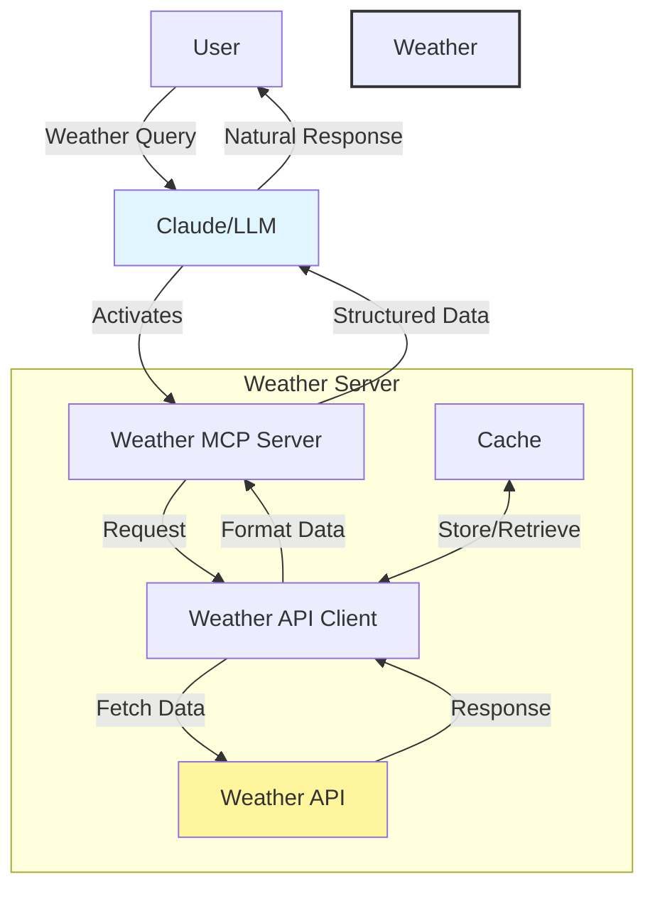

# weather-server MCP Server

MCP-server

This is a TypeScript-based MCP server that implements a simple notes system. It demonstrates core MCP concepts by providing:

- Resources representing text notes with URIs and metadata
- Tools for creating new notes
- Prompts for generating summaries of notes

## Features

### Resources
- List and access notes via `note://` URIs
- Each note has a title, content and metadata
- Plain text mime type for simple content access

### Tools
- `create_note` - Create new text notes
  - Takes title and content as required parameters
  - Stores note in server state

### Prompts
- `summarize_notes` - Generate a summary of all stored notes
  - Includes all note contents as embedded resources
  - Returns structured prompt for LLM summarization

## How the Weather Server Works with LLMs

The weather-server uses the Model Context Protocol (MCP) to enhance LLM interactions by providing structured weather data. Here's how it works:



**Process Flow:**

1. **Initial Query**: User asks the LLM about weather conditions
2. **MCP Detection**: LLM recognizes weather-related query and activates the MCP server
3. **Data Retrieval**: Weather server fetches relevant weather data
4. **Context Enhancement**: Server provides structured weather data back to LLM
5. **Response Generation**: LLM uses enhanced context to provide accurate weather information

### Tools Integration
- Weather data is provided through MCP tools like `get_weather` and `get_forecast`
- Each tool returns structured JSON data that the LLM can easily interpret
- Historical data is cached for efficient responses

## Development

Install dependencies:
```bash
npm install
```

Build the server:
```bash
npm run build
```

For development with auto-rebuild:
```bash
npm run watch
```

## Installation

To use with Claude Desktop, add the server config:

On MacOS: `~/Library/Application Support/Claude/claude_desktop_config.json`
On Windows: `%APPDATA%/Claude/claude_desktop_config.json`

```json
{
  "mcpServers": {
    "weather-server": {
      "command": "/path/to/weather-server/build/index.js"
    }
  }
}
```

### Debugging

Since MCP servers communicate over stdio, debugging can be challenging. We recommend using the [MCP Inspector](https://github.com/modelcontextprotocol/inspector), which is available as a package script:

```bash
npm run inspector
```

The Inspector will provide a URL to access debugging tools in your browser.
